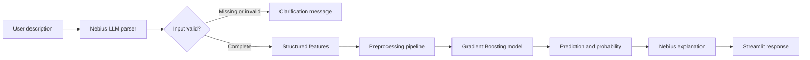

# Adult Income Prediction Assistant

An end-to-end machine-learning application that predicts whether a fictional profile resembles the historical UCI Adult Income category `<=50K` or `>50K`.

The application combines:

- A trained binary classification model
- MLflow experiment tracking
- Natural-language feature extraction using an LLM
- A Streamlit web interface
- Automated testing with pytest
- Continuous integration with GitHub Actions
- Docker deployment

## Project Overview

The Adult Income Prediction Assistant allows a user to describe a fictional profile in plain English.

Example:

> I am 42 years old, work for a private company, have a bachelor's degree, and work in management. I am married, listed as a husband in my household, White, male, work 45 hours per week, and I am from the United States. I have no capital gains or losses.

The application:

1. Sends the description to an LLM.
2. Extracts structured model features.
3. Validates required values.
4. Requests clarification when information is missing or invalid.
5. Runs the trained machine-learning model.
6. Displays the predicted income category and probability.
7. Generates a contextual explanation with limitations.

## Intended Use

This application is an educational machine-learning portfolio project.

It demonstrates how a traditional supervised-learning model can be connected to a natural-language interface and deployed using production-oriented MLOps practices.

It must not be used for:

- Hiring or employment decisions
- Lending or credit decisions
- Insurance decisions
- Immigration decisions
- Benefits or eligibility decisions
- Any other consequential decision about a real person

## Dataset

The project uses the Adult Income dataset from the UCI Machine Learning Repository.

Dataset characteristics:

- 48,842 records
- 14 model features
- Binary classification target
- Numerical and categorical variables
- Missing categorical values
- Historical United States Census information

Target classes:

- `0`: income category `<=50K`
- `1`: income category `>50K`

The dataset is downloaded programmatically using `ucimlrepo`.

## Repository Structure

```text
adult-income-llm-capstone/
├── .github/
│   └── workflows/
│       └── ci.yml
├── configs/
│   └── config.yaml
├── data/
│   ├── raw/
│   └── processed/
├── models/
├── notebooks/
├── reports/
├── src/
│   ├── __init__.py
│   ├── app.py
│   ├── check_nebius.py
│   ├── compare_experiments.py
│   ├── data_loader.py
│   ├── evaluate.py
│   ├── llm_parser.py
│   ├── preprocess.py
│   └── train.py
├── tests/
│   ├── __init__.py
│   ├── test_interface.py
│   ├── test_model.py
│   └── test_preprocess.py
├── .dockerignore
├── .env.example
├── .gitignore
├── Dockerfile
├── README.md
└── requirements.txt
```

Raw datasets, trained models, generated reports, MLflow databases, and API secrets are excluded from Git.

## Architecture



### Machine-learning layer

The trained scikit-learn pipeline contains:

1. Median imputation for numerical features
2. Standard scaling for numerical features
3. Most-frequent imputation for categorical features
4. One-hot encoding for categorical features
5. A binary classification model

Keeping preprocessing and prediction in one pipeline prevents training-serving inconsistencies and reduces data-leakage risk.

### LLM layer

The LLM is used for two focused tasks:

1. Converting natural-language descriptions into structured feature values
2. Explaining the model prediction in plain English

The LLM does not replace the trained machine-learning model. The final probability comes from the selected scikit-learn model.

## Preprocessing

The preprocessing workflow:

- Standardizes column names
- Removes categorical whitespace
- Converts `?`, blank strings, `None`, and `pd.NA` into missing values
- Removes trailing periods from target labels
- Encodes the target as `0` or `1`
- Imputes missing numerical values with the median
- Imputes missing categorical values with the most frequent value
- Scales numerical features
- One-hot encodes categorical features
- Preserves the original dataframe
- Fits preprocessing only on the training split

The original 14 input features become 105 transformed features after preprocessing.

## Model Training

Five meaningfully different experiment configurations were trained:

1. Logistic Regression with `C=0.1`
2. Logistic Regression with `C=1.0`
3. Random Forest with 200 trees
4. Random Forest with 400 trees
5. Gradient Boosting

Training parameters are stored in:

```text
configs/config.yaml
```

The training script reads model settings from YAML rather than hardcoding the configurations.

## Model Results

| Model | Accuracy | Precision | Recall | F1 | ROC-AUC |
|---|---:|---:|---:|---:|---:|
| Gradient Boosting | 0.8692 | 0.8060 | 0.5971 | 0.6860 | **0.9215** |
| Random Forest 400 | 0.8300 | 0.6063 | 0.8259 | **0.6993** | 0.9168 |
| Random Forest 200 | 0.8095 | 0.5665 | 0.8691 | 0.6859 | 0.9164 |
| Logistic Regression C=0.1 | 0.8069 | 0.5651 | 0.8388 | 0.6753 | 0.9041 |
| Logistic Regression C=1.0 | 0.8068 | 0.5651 | 0.8370 | 0.6747 | 0.9040 |

## Best Model Selection

Gradient Boosting was selected because the project configuration uses ROC-AUC as the primary model-selection metric.

Its results were:

- Accuracy: 0.8692
- Precision: 0.8060
- Recall: 0.5971
- F1: 0.6860
- ROC-AUC: 0.9215

ROC-AUC measures the model's ability to rank positive examples above negative examples across classification thresholds.

Random Forest 400 achieved the strongest F1 score, at 0.6993, and substantially higher recall. This is an important tradeoff: Gradient Boosting provided the strongest overall probability ranking and precision, while Random Forest provided a better precision-recall balance at the default threshold.

## Experiment Tracking

MLflow tracks every training run.

Each run logs:

- Model type
- Model hyperparameters
- Random seed
- Train/test split settings
- Dataset description
- Dataset version
- Accuracy
- Precision
- Recall
- F1 score
- ROC-AUC
- Model configuration artifact
- Trained preprocessing and model pipeline

The comparison script uses:

```python
mlflow.search_runs()
```

to query completed runs and identify the best experiment programmatically.

Run the comparison with:

```powershell
python -m src.compare_experiments
```

Launch the MLflow interface with:

```powershell
mlflow ui --backend-store-uri sqlite:///mlflow.db
```

Then open:

```text
http://localhost:5000
```

## Local Setup

### Prerequisites

- Python 3.11
- Git
- A Nebius Token Factory account
- A Nebius API key
- An available Nebius chat model

### Clone the repository

```powershell
git clone https://github.com/patrickfelder777-cpu/adult-income-llm-capstone.git
cd adult-income-llm-capstone
```

### Create the virtual environment

```powershell
py -3.11 -m venv .venv
.\.venv\Scripts\Activate.ps1
```

### Install dependencies

```powershell
python -m pip install --upgrade pip
python -m pip install -r requirements.txt
```

### Configure environment variables

Copy the example file:

```powershell
Copy-Item .env.example .env
```

Update `.env`:

```env
NEBIUS_API_KEY=your_real_api_key
NEBIUS_BASE_URL=https://api.tokenfactory.nebius.com/v1/
NEBIUS_MODEL=Qwen/Qwen3-30B-A3B-Instruct-2507
```

Never commit the `.env` file or expose an API key in source code.

### Download the dataset

```powershell
python -m src.data_loader
```

### Train the models

```powershell
python -m src.train
```

### Compare experiments

```powershell
python -m src.compare_experiments
```

### Run the tests

```powershell
pytest tests\ -v
```

### Start the application

```powershell
python -m streamlit run .\src\app.py
```

Open:

```text
http://localhost:8501
```

## Example Application Request

```text
I am 42 years old, work for a private company, have a bachelor's
degree, and work in management. I am married, listed as a husband
in my household, White, male, work 45 hours per week, and I am
from the United States. I have no capital gains or capital losses.
```

## Edge-Case Example

```text
I am 35 years old and work 40 hours per week.
```

The application should not produce a prediction because required information is missing. It should ask the user to provide the missing fields.

An out-of-scope request, such as a weather question, should also be rejected rather than converted into an invalid prediction.

## Testing

The project contains tests for preprocessing, model behavior, and interface logic.

### Preprocessing tests

The tests verify:

- Missing categorical values are handled
- Categorical whitespace is removed
- Target values are encoded correctly
- The original dataframe is not modified
- No missing values remain after transformation
- Numerical features are standardized

### Model tests

The tests verify:

- Prediction shape and data type
- Binary prediction values
- Probability shape and range
- Probability rows sum to one
- ROC-AUC meets a minimum threshold

### Interface tests

The tests verify:

- Natural-language features are parsed correctly
- Incomplete input is detected
- Invalid numerical values are rejected
- Model input contains all 14 required columns

Run all tests:

```powershell
pytest tests\ -v
```

Expected result:

```text
13 passed
```

## Continuous Integration

The GitHub Actions workflow runs automatically on pushes and pull requests to `main`.

The workflow:

1. Checks out the repository
2. Sets up Python 3.11
3. Installs pinned dependencies
4. Checks Python syntax
5. Downloads the Adult dataset
6. Trains all five model configurations
7. Compares MLflow experiments
8. Runs the complete pytest suite
9. Verifies the generated model
10. Verifies experiment reports

The live Nebius API is not called during CI. Interface tests use a controlled fake client, so API secrets are not required in GitHub Actions.

## Docker

Build the Docker image:

```powershell
docker build -t adult-income-llm-capstone .
```

Run it using the local environment file:

```powershell
docker run --rm --name adult-income-app --env-file .env -p 8501:8501 adult-income-llm-capstone
```

Open:

```text
http://localhost:8501
```

The Docker image:

- Uses Python 3.11
- Installs pinned dependencies
- Downloads the Adult dataset
- Trains the configured models
- Packages the best model
- Launches Streamlit on port 8501
- Includes an application health check

## Limitations and Ethical Considerations

The Adult dataset contains historical Census information and sensitive demographic attributes.

Important limitations include:

- The dataset reflects historical patterns rather than current economic conditions.
- Historical data may contain social and demographic bias.
- Income category is not a complete measure of financial well-being.
- The model may perform differently across demographic groups.
- The application uses a median replacement for `fnlwgt`, a Census sampling-weight feature that normal users would not know.
- Predictions are model estimates, not verified statements about individuals.
- Probability scores should not be interpreted as certainty.
- LLM parsing can occasionally misinterpret ambiguous language.

This application is restricted to educational and portfolio use.

## Reflection

This project combined concepts from across the machine-learning program into one working system.

### What I learned

- How to build a reusable preprocessing and model pipeline
- How to prevent data leakage by fitting transformations only on training data
- How to compare multiple model configurations
- How to track experiments with MLflow
- How to select the best run programmatically
- How to connect a traditional ML model to an LLM interface
- How to validate incomplete and invalid natural-language input
- How to test preprocessing, model performance, and interface logic
- How to package an ML application with Docker
- How to automate training and testing with GitHub Actions

### Most challenging areas

The most challenging parts were:

- Correctly handling pandas missing values with scikit-learn imputers
- Saving the complete preprocessing pipeline through MLflow
- Designing a reliable JSON-based LLM parsing contract
- Preventing the LLM from guessing sensitive missing values
- Keeping secrets outside Git and Docker images
- Reproducing the full training workflow in Docker and GitHub Actions

### Future improvements

With more time, the project could be improved by:

- Evaluating fairness metrics across demographic groups
- Calibrating probability estimates
- Tuning the classification threshold
- Adding SHAP-based local explanations
- Replacing the Census sampling-weight feature
- Comparing additional models such as XGBoost or HistGradientBoosting
- Using an MLflow Model Registry
- Deploying the application to a managed cloud platform
- Reducing the Docker image size
- Adding structured Streamlit form fields as an alternative to LLM parsing

## Author

Patrick Felder

GitHub:

```text
https://github.com/patrickfelder777-cpu
```

## Demo Video

Watch the complete project demonstration:

[Adult Income Prediction Assistant — Project Demo](https://drive.google.com/file/d/1V6juQ781uY_k30VU8_zLrBRtuNA8zjAj/view?usp=sharing)

The demo includes:

- The GitHub repository structure
- A successful GitHub Actions workflow
- Five MLflow experiment runs
- Natural-language feature extraction
- A prediction from the trained machine-learning model
- An LLM-generated explanation
- Graceful handling of incomplete input